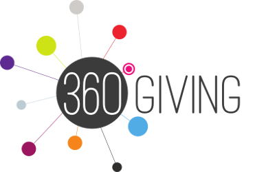
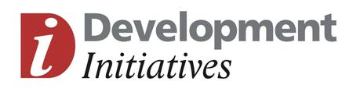
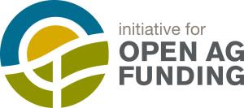
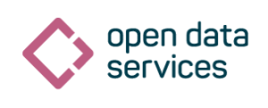

Members & governance
====================

<style><!--
    img {
        float:right;
        width:200px;
        padding:10px;
    }
--></style>

org-id.guide is a member-led project, building a well-governed open register of organization identifier lists.

Anyone can use org-id.guide. 

Members contribute to maintain the quality of register research and meta-data, and as part of a commitment to integrate the org-id.guide register into their standards and applications.

## Member benefits

To find you about becoming an org-id.guide member, e-mail contact@org-id.guide 

Members benefit from: 

* **Priority support from the reseach team.** Requests, proposals and change suggestions from members will be given highest priority. 
* **Direct engagement with member communities.** The research team will accept messages directly from member's own helpdesk or support systems, and will feedback directly.
* **Governance role.** Members are consulted on all new register entries and deprecation, and work together to set future directions for the project.

<!-- * **Discounted data QA support.** Members get a discount on data QA support.   TODO: CHECK THIS POINT--> 

## Members list


**[360Giving](http://www.threesixtygiving.org)**

360Giving supports organisations to publish their grants data in an open, standardised way and helps people to understand and use the data in order to support decision-making and learning across the charitable giving sector.

Organisation identifier: ```GB-COH-09668396```


**Development Initiatives ([Joined Up Data Standards project](http://juds.joinedupdata.org/))**

Joining up data standards is a vital part of turning more data into better information to drive sustainable development.

Organisation identifier: ```GB-COH-06368740```


**[International Aid Transparency Initiative (IATI) Secretariat](http://www.aidtransparency.net/governance/secretariat)**

IATI makes information about aid spending easier to access, use and understand.

Organisation identifier: n/a


**[Natural Resource Governance Institute](http://www.resourcegovernance.org/)**

We help people to realize the benefits of their countries’ endowments of oil, gas and minerals.

Organisation identifier: ```US-EIN-20-4451390```


**[Initative for Open Ag Funding](https://www.interaction.org/project/open-ag-funding/overview)**

We are a group of like-minded organizations who believe in the power of data to improve sustainable development. Our works supports efforts to end hunger and food insecurity by ensuring organizations have the information they need to make smarter investments in the agriculture and food security sector.

Organisation identifier: ```US-EIN-13-3287064``` [InterAction’s identifier]


**[Open Data Services Co-operative](http://www.opendataservices.coop)**

We help people publish and use open data.

Organisation identifier: ```GB-COH-09506232```

## Supporters

The following organizations have indicated their support for the project by becoming active contributors, or committing to make use of the org-id.guide register. 


[Open Contracting Partnership (OCP)](http://www.open-contracting.org/)

We connect governments, civil society and business to open up and monitor public contracting.

Organisation identifier: n/a


[Open Corporates](http://www.opencorporates.com)

OpenCorporates aims to do a straightforward (though big) thing: have a URL for every company in the world.

Organisation identifier: ```GB-COH-07444723```


[ePaństwo Foundation](http://epf.org.pl/)

ePaństwo Foundation's aim is to develop democracy, open and transparent authorities and civic engagement using new technologies.

Organisation identifiers: ```PL-NIP-1231216692```, ```PL-REGON-142445947```,  ```PL-KRS-0000359730```.

 
[DatosElSalvador.org](http://DatosElSalvador.org)

DatosElSalvador.org is the first open data portal in El Salvador, built by citizen, that provides dataset of economics, social, enviromental, transportation, education, health and government operations open data, according to the best international practices and the open data principles.

Organisation identifier: tbc


[Linked Economy](http://linkedeconomy.org/)

Linked Economy aims at providing a universal access to Greek and International economy data.